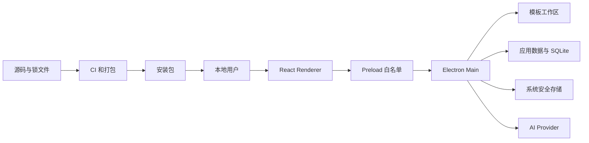

# 智能算法学习助手 V2 威胁模型

## Executive summary

本项目是单用户、本地运行且不监听公网端口的 Electron 桌面应用。最高价值资产是用户模板与题目数据、Provider API Key，以及能够修改模板工作区的 Main 进程权限。当前没有 Critical/High 级已确认代码漏洞；主要风险集中在恶意或被攻陷的 AI Provider、模型输出诱导文件变更、用户配置的 HTTPS Base URL 访问内网、同一 OS 账户下的文件竞争，以及未签名发布产物的供应链替换。现有的 Renderer 沙箱、白名单 IPC、Zod 校验、路径守卫、计划预览、备份回滚和系统安全存储显著降低了风险，但代码签名/公证与备份保留策略仍是正式公开分发前的重点。

## Scope and assumptions

- 范围：`src/main/`、`src/preload/`、`src/renderer/`、`src/core/`、数据库 migration、打包配置、CI 与真实 Electron E2E。
- 运行模型：单用户本地桌面应用；无账号、多租户、公开服务端或运行时监听端口。
- 用户主动选择模板工作区并配置 Provider；OS 用户账户及系统密钥环作为基础可信边界。
- 模板源码、题面、图片、笔记、SQLite 数据和 API Key 均为敏感资产。
- 测试专用本地 HTTP 仅在 `NODE_ENV=test` 且显式设置开关时允许；测试 mock 不属于生产攻击面（`src/main/services/ai-provider-service.ts:46-52`）。
- CI、依赖源、签名证书与发布渠道属于构建/发布边界；旧项目与旧数据迁移明确不在范围内。

会显著改变评级的开放问题：未来若加入云同步、自动更新、社区模板或多用户服务端，需要重新建模身份、租户隔离、远程入口和更新签名；若允许组织管理员预置 Provider，则 Base URL 的控制者也需要重新定义。

## System model

### Primary components

- React Renderer：展示模板、题目、AI 草稿和文件计划，只能调用 `window.desktop`。
- Preload：通过 `contextBridge` 暴露按领域划分的最小 API，不暴露原始 `ipcRenderer`（`src/preload/index.ts:20-78`）。
- Electron Main：验证 IPC、访问文件、SQLite、系统对话框、安全存储和 Provider 网络。
- 模板工作区：用户明确授权的外部目录，源码的真实来源。
- 应用数据目录：SQLite、题目图片、密钥密文和仍可撤销计划的备份。
- AI Provider：用户选择的外部 HTTPS 服务，或本机 Ollama loopback 服务。
- CI/打包：锁定依赖、执行检查、生成 macOS 与 Windows 产物（`.github/workflows/quality.yml:12-65`）。

### Data flows and trust boundaries

- 用户 → Renderer：题面、源码、路径建议、Provider 配置与确认操作；React 默认转义文本，表单有长度与类型约束。
- Renderer → Preload → Main：结构化 IPC；每个 handler 使用 Zod schema 解析，错误转换为有限公开错误（`src/main/ipc/register-validated-handler.ts:15-30`）。
- Main → 模板工作区：文件读取、独占创建、移动、删除与恢复；路径经过规范化、realpath 和符号链接检查（`src/main/security/path-guard.ts:27-63`）。
- Main → 应用数据目录：SQLite migration、图片、加密密钥和计划备份；密钥文件限制引用格式、权限与大小（`src/main/security/secret-store.ts:34-93`）。
- Main → AI Provider：HTTPS JSON 请求携带用户内容和 API Key；禁止重定向，有超时和 1 MiB 响应上限（`src/main/services/ai-provider-adapters.ts:42-93`）。
- AI Provider → Main：不可信模型 JSON；使用任务专用 schema、模板 ID 白名单和允许操作集合过滤后，先展示草稿/计划再确认。
- 开发者 → CI → 安装包：Git 提交、锁文件、npm 依赖与构建配置；CI 使用 `npm ci`、审计、检查和平台打包，但正式签名身份尚未配置。

#### Diagram

## Assets and security objectives

| Asset                    | Why it matters                             | Security objective (C/I/A) |
| ------------------------ | ------------------------------------------ | -------------------------- |
| 模板源码与目录结构       | 用户长期积累，误删或篡改可能不可恢复       | I/A，部分 C                |
| 题目、图片、笔记与关联   | 包含学习记录和可能私密的题面内容           | C/I/A                      |
| Provider API Key         | 泄露可导致费用、配额和外部数据风险         | C/I                        |
| SQLite 与 migration 状态 | 决定全部卡片、关系、配置和操作记录的一致性 | I/A                        |
| 文件计划备份             | 可恢复删除/移动，也复制了敏感模板内容      | C/I/A                      |
| Provider 路由与 Base URL | 控制数据发送对象和模型行为                 | I                          |
| 安装包与发布元数据       | 被替换会让攻击者获得本地 Main 进程权限     | I/A                        |

## Attacker model

### Capabilities

- 控制或攻陷用户主动配置的远程 AI Provider，并返回恶意或超大响应。
- 将提示注入内容放入题面、截图或模板源码，试图影响模型草稿和文件计划。
- 诱导用户安装被替换的未签名产物，或污染依赖/CI 构建输入。
- 在与应用同一 OS 账户下运行恶意进程，竞争修改模板路径、数据库或应用数据。
- 诱导本地用户配置一个指向内网 HTTPS 服务的 Base URL。

### Non-capabilities

- 不假设存在无需用户操作的公网入口、远程账号接管、跨租户访问或浏览器 Cookie 会话。
- 不假设普通远程攻击者能直接调用本地 IPC、读取系统密钥环或任意写入用户工作区。
- 同账户攻击者通常已能直接读取/修改用户文件，因此相关风险以完整性加固和事故防护为主，不按远程提权评级。

## Entry points and attack surfaces

| Surface                   | How reached          | Trust boundary               | Notes                                                  | Evidence (repo path / symbol)                                                                                          |
| ------------------------- | -------------------- | ---------------------------- | ------------------------------------------------------ | ---------------------------------------------------------------------------------------------------------------------- |
| Renderer IPC              | 本地 UI 操作         | Renderer → Main              | 白名单通道，输入/输出 schema 校验                      | `src/preload/index.ts:20-78`; `src/main/ipc/register-validated-handler.ts:15-30`                                       |
| 模板目录与源码            | 选择目录、上传或粘贴 | 用户文件 → Main              | realpath、符号链接、扩展名、大小与独占创建控制         | `src/main/security/path-guard.ts:27-63`; `src/main/security/template-path.ts:6-27`                                     |
| 题目图片                  | 文件选择或剪贴板     | 图片数据 → Main              | 数量、总大小、媒体魔数和写入权限限制                   | `src/main/services/problem-analysis-service.ts:144-186`                                                                |
| Provider Base URL/headers | 设置页面             | 用户配置 → 网络              | HTTPS；Ollama 仅 loopback HTTP；敏感头禁用             | `src/main/services/ai-provider-service.ts:34-70`                                                                       |
| AI 响应                   | 外部 Provider 返回   | 网络 → Main                  | 响应大小、JSON 和任务 schema 校验                      | `src/main/services/ai-provider-adapters.ts:68-93`; `src/main/services/problem-analysis-service.ts:97-134`              |
| 文件计划确认              | 用户确认 AI 建议     | AI 计划 → 文件系统           | 允许操作过滤、逐项选择、备份、冲突预检                 | `src/main/services/template-management-service.ts:190-230`; `src/main/services/template-management-service.ts:241-379` |
| 应用窗口内容              | 本地打包资源         | Renderer → Electron 权限边界 | sandbox、contextIsolation、禁 Node、CSP、拒绝导航/权限 | `src/main/window/create-main-window.ts:15-25`; `src/main/security/window-security.ts:22-49`                            |
| CI 与安装包               | push/PR 与下载       | 开发供应链 → 用户设备        | 锁文件与平台构建已配置，签名/公证待完成                | `.github/workflows/quality.yml:12-65`; `package.json:84-126`                                                           |

## Top abuse paths

1. 攻击者控制 Provider → 在模型 JSON 中建议任意路径或模板 ID → Main 的 schema、ID 白名单和操作 allowlist 丢弃无效项 → 若用户仍确认合法范围内的破坏性建议，只影响当前授权工作区且可从备份撤销。
2. 恶意题面包含提示注入 → Provider 尝试把指令当系统要求 → 系统提示声明输入不可信，模型结果只形成可编辑草稿 → 用户确认后才写入卡片与关联。
3. 用户被诱导配置内网 HTTPS Base URL → Main 携带自定义请求访问该地址 → 可能探测内网或把题面发送给错误服务；需要 UI 风险提示或可选私网阻断进一步降低风险。
4. 同账户进程在 realpath 校验后替换路径 → Main 对已检查路径执行移动/读取 → 理论上造成 TOCTOU；攻击前提已包含同账户文件写权限，现有冲突与哈希检查限制撤销覆盖。
5. 攻击者取得应用数据目录副本 → 读取 SQLite、题目图片和计划备份 → API Key 仍由系统安全存储密文保护，但题目/模板副本可能泄露。
6. 恶意 Provider 返回无限/超大正文 → Main 在读取前检查 `content-length` 并在读取后检查 1 MiB，超时使用 AbortController → 请求被中止或作为无效响应拒绝。
7. 攻击者替换未签名 DMG/ZIP → 用户绕过系统警告运行 → 攻击者获得与应用相同的本地权限；正式公开发布必须代码签名、公证并公布校验值。
8. 供应链依赖被污染 → CI 安装恶意包并生成产物 → 锁文件、`npm ci` 与 `npm audit` 降低漂移，但仍需要受保护分支、最小 CI 权限和签名发布链。

## Threat model table

| Threat ID | Threat source            | Prerequisites                      | Threat action                                | Impact                     | Impacted assets            | Existing controls (evidence)                                                                                                                                    | Gaps                                                               | Recommended mitigations                                                                      | Detection ideas                                             | Likelihood | Impact severity | Priority |
| --------- | ------------------------ | ---------------------------------- | -------------------------------------------- | -------------------------- | -------------------------- | --------------------------------------------------------------------------------------------------------------------------------------------------------------- | ------------------------------------------------------------------ | -------------------------------------------------------------------------------------------- | ----------------------------------------------------------- | ---------- | --------------- | -------- |
| TM-001    | 恶意/被攻陷 Provider     | 用户配置并调用该 Provider          | 返回诱导性题目草稿或文件计划                 | 错误卡片、误移动/删除模板  | 模板、题目、关系           | schema、模板 ID 白名单、操作 allowlist、预览确认、备份回滚（`src/main/services/template-management-service.ts:190-230,241-379`）                                | 用户仍可能误确认看似合理的计划                                     | Diff 中突出来源、目标和删除；保留 Provider/模型审计字段；未来增加计划风险评分                | 统计被过滤操作、撤销率和 Provider 错误类型，不记录源码/题面 | 中         | 高              | 中       |
| TM-002    | 提示注入内容             | 恶意题面、图片或源码进入 AI 上下文 | 覆盖模型指令或要求输出伪造字段               | 草稿污染、错误推荐         | 题目、模板元数据           | 明确不信任输入的系统提示、严格 JSON/schema、草稿确认（`src/main/services/problem-analysis-service.ts:79-100`）                                                  | 模型仍可能遵循注入；语义正确性不能由 schema 保证                   | UI 显示“AI 建议”；高风险计划默认不选；对删除保持确定性重复审计前置                           | 记录结构化验证失败计数与用户取消率                          | 中         | 中              | 中       |
| TM-003    | 本地用户误配或社会工程   | 用户手工输入自定义 Base URL        | 让 Main 请求内网 HTTPS 地址或错误外部服务    | 内网探测、隐私数据外发     | 题面、源码片段、网络元数据 | HTTPS、禁止重定向、敏感头禁用、超时（`src/main/services/ai-provider-service.ts:34-70`; `src/main/services/ai-provider-adapters.ts:42-65`）                      | HTTPS 私网地址仍允许，这是自定义 Provider 功能的条件性 SSRF 面     | 对私网/本机非 Ollama 地址显示强提示；企业模式可默认阻断 RFC1918/本机解析结果                 | 显示最终主机和协议；本地记录不含内容的目标域/错误类别       | 低         | 中              | 低       |
| TM-004    | 同 OS 账户恶意进程       | 已有工作区或应用数据写权限         | 在校验与使用之间替换文件/目录，或篡改 SQLite | 文件错误修改、状态不一致   | 模板、数据库、备份         | realpath、拒绝 symlink、路径范围检查、目标冲突、撤销哈希（`src/main/security/path-guard.ts:27-63`; `src/main/services/template-management-service.ts:416-458`） | Node 路径操作无法完全消除所有 TOCTOU；SQLite 无独立完整性签名      | 对关键写操作继续使用独占创建与原子 rename；执行前后核对 inode/hash；文档声明同账户边界       | 文件哈希/mtime 冲突提示，避免记录内容                       | 低         | 高              | 低       |
| TM-005    | 本地文件读取者或备份软件 | 获得用户账户或应用数据访问         | 复制题目图片、SQLite 或尚可撤销的备份        | 隐私泄露                   | 题面、笔记、模板副本       | 密钥单独加密、目录/文件权限、撤销成功即清理备份（`src/main/security/secret-store.ts:70-93`; `src/main/services/template-management-service.ts:478-499`）        | 可撤销计划的备份需保留；SQLite/图片依赖 OS 磁盘保护                | 增加备份保留期限和手动清理入口；发布隐私说明；建议启用全盘加密                               | 启动时统计过期备份数量，不采集文件名或内容                  | 低         | 中              | 低       |
| TM-006    | 远程 Provider            | Provider 响应请求                  | 返回超大、畸形或慢响应耗尽资源               | UI 卡顿、请求失败          | 可用性                     | 超时、禁止重定向、1 MiB 响应限制、任务 schema（`src/main/services/ai-provider-adapters.ts:42-93`）                                                              | `response.text()` 在无 content-length 时仍会先缓冲，之后才校验     | 未来改为流式读取并在 1 MiB 立即中止；限制并发任务数                                          | 统计超时/超限错误，不记录响应正文                           | 中         | 低              | 低       |
| TM-007    | 发布链攻击者             | 用户下载未签名或来源不明产物       | 替换 DMG/ZIP/NSIS 或植入构建产物             | 本地代码执行、全部资产失陷 | 全部运行时资产             | CI 平台构建、锁文件、审计、ASAR、macOS hardened runtime（`.github/workflows/quality.yml:12-65`; `package.json:84-126`）                                         | 当前无 Developer ID 签名、公证和已验证发布渠道；Windows 未实机验证 | 公布前启用 macOS 签名+notarization、Windows Authenticode；受保护发布环境；生成 checksum/SBOM | CI 保存签名验证、hash 和 provenance；发布后验证下载样本     | 中         | 高              | 中       |
| TM-008    | 依赖或 CI 供应链         | 恶意依赖版本、Action 或凭证        | 在安装/构建阶段执行代码并污染产物            | 发布包被植入               | 源码、构建产物             | package-lock、只读 CI 权限、`npm ci`、audit、分平台构建（`.github/workflows/quality.yml:8-65`）                                                                 | Actions 只按 major tag；未生成 SBOM/provenance                     | 将 Actions 固定到 commit SHA；启用 Dependabot、SBOM 和 artifact attestation                  | Dependabot/CodeQL/审计告警，审查锁文件大变更                | 低         | 高              | 低       |

## Criticality calibration

- Critical：无需用户确认即可远程执行 Main 进程代码；远程窃取系统安全存储中的全部 API Key；发布密钥被盗并用于可信签名恶意更新。
- High：可稳定绕过路径授权修改工作区外文件；无需确认批量删除不可恢复模板；公开发布链可被替换且用户无法识别。
- Medium：恶意 Provider 可在用户确认链中显著影响数据；未签名产物的替换风险；可重复造成有限隐私泄露或工作区级破坏但有恢复手段。
- Low：需要同一 OS 账户现有文件权限的竞争；用户主动配置错误端点后的条件性内网访问；易恢复或有严格大小限制的可用性问题。

## Focus paths for security review

| Path                                               | Why it matters                     | Related Threat IDs             |
| -------------------------------------------------- | ---------------------------------- | ------------------------------ |
| `src/main/security/path-guard.ts`                  | 文件授权、realpath 与符号链接边界  | TM-004                         |
| `src/main/services/template-management-service.ts` | AI 计划过滤、文件变更、备份与撤销  | TM-001, TM-002, TM-004, TM-005 |
| `src/main/services/ai-provider-service.ts`         | Base URL、敏感请求头和任务路由     | TM-003                         |
| `src/main/services/ai-provider-adapters.ts`        | 外部网络、密钥传输、超时和响应限制 | TM-003, TM-006                 |
| `src/main/security/secret-store.ts`                | API Key 加密与文件引用             | TM-005                         |
| `src/main/services/problem-analysis-service.ts`    | 图片解析、提示注入与草稿提交       | TM-002                         |
| `src/main/ipc/`                                    | Renderer 到特权 Main 的输入边界    | TM-001, TM-004                 |
| `src/preload/index.ts`                             | Renderer 可见能力清单              | TM-001                         |
| `src/main/window/create-main-window.ts`            | Electron 沙箱和 Node 隔离          | TM-007                         |
| `src/main/security/window-security.ts`             | CSP、权限、导航和窗口控制          | TM-007                         |
| `src/main/database/migrations.ts`                  | 用户数据升级完整性                 | TM-004                         |
| `.github/workflows/quality.yml`                    | CI 权限、依赖与发布产物            | TM-007, TM-008                 |
| `package.json`                                     | 打包目标、ASAR、签名与原生模块     | TM-007, TM-008                 |

质量核对：已覆盖 UI/IPC、文件、数据库/应用数据、网络 Provider、AI 响应和 CI/发布入口；每个运行时与构建信任边界至少出现在一个威胁中；测试开关与生产行为已分开；所有单用户、本地、无公网端口假设均明确记录。
